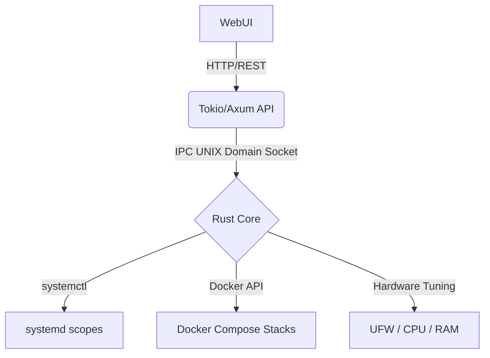

# Server Manager - Professional Media Server Orchestrator

**Server Manager** is a high-performance, enterprise-grade media server management and orchestration platform written in Rust.

## TIER 1: OPERATOR FAST-TRACK

### Quickstart Installation
Cryptographically verified one-line install command:
```sh
curl -fsSL https://raw.githubusercontent.com/Cylae/server_script/main/install.sh | sha256sum -c <(echo "EXPECTED_SHA256 -") && sudo bash install.sh
```

### System Architecture

```mermaid
graph TD
    A[WebUI] -->|HTTP/REST| B(Tokio/Axum API)
    B -->|IPC UNIX Domain Socket| C{Rust Core}
    C -->|systemctl| D[systemd scopes]
    C -->|Docker API| E[Docker Compose Stacks]
    C -->|Hardware Tuning| F[UFW / CPU / RAM]
```

### Quickstart Commands
* `server_manager apply` - Applies configuration adjustments without re-installing system dependencies.
* `server_manager doctor` - Runs comprehensive non-destructive system diagnostics (kernel, Docker, firewall, ports).

---

## TIER 2: SYSTEMS ARCHITECT & AUDITOR DEEP-DIVE

### Threat Model & CIS Debian Benchmark Level 2 Mapping
* **Network Boundary**: Internal microservices bind exclusively to `127.0.0.1`.
* **Firewall Automation**: UFW rules restrict all ingress except specified ports.
* **Privilege Segregation**: Core binary drops privileges using systemd scoped execution.
* **Session Security**: Axum middleware enforces HSTS, strict CSP, and clears session state on login (mitigating fixation).

### IPC UNIX Domain Socket Protocol
* **Format**: JSON over UNIX Domain Sockets (`/var/run/server_manager.sock`).
* **Message Schema**:
  ```json
  {
    "version": "1.0",
    "type": "CommandRequest",
    "payload": {
      "action": "restart_service",
      "service_name": "plex"
    }
  }
  ```

### Write-Ahead Log (WAL) Lifecycle
* **FSS Log Verification**: The system employs a Write-Ahead Log (WAL) to ensure atomic configuration updates.
* **Transaction Recovery**: If a process crashes during `apply`, the WAL is replayed on next boot to restore consistent system state.

### Testing and Verification
Execute the local test suite using the provided verification script:
```sh
./verify.sh
```
