# 🚀 Cylae Server Manager (v6.0)

   

> **The Ultimate "Set & Forget" Self-Hosting Solution.**  
> *Universal Edition | Auto-Tuning | Fully Modular*

---

## 🇬🇧 English Version

### 📖 Introduction
**Cylae Server Manager** is a premium, all-in-one Bash framework designed to transform **ANY** fresh Debian/Ubuntu server into a production-ready fortress. 

Whether your domain is `cyl.ae`, `example.com`, or `my-awesome-server.net`, this script adapts automatically. It detects your hardware to optimize performance, manages services via Docker, handles SSL certificates automatically, and even updates itself and your entire system while you sleep.

### 🏗️ Architecture
The system is built on a robust stack designed for stability and speed.

```mermaid
graph LR
    %% Nodes
    User(("👤 User"))
    Nginx["⚡ Nginx Proxy"]
    
    subgraph Services ["🚀 Services"]
        direction TB
        Dash["🖥️ Dashboard"]
        Cloud["☁️ Nextcloud"]
        Git["🐙 Gitea"]
        Pass["🔑 Vaultwarden"]
        Mail["📧 Mail"]
    end
    
    subgraph Data ["💾 Data"]
        DB[("🗄️ MariaDB")]
        Docker[("🐳 Docker")]
    end

    %% Flow
    User -->|HTTPS| Nginx
    Nginx --> Dash
    Nginx --> Cloud
    Nginx --> Git
    Nginx --> Pass
    Nginx --> Mail
    
    Services -.-> Data
```



### ✨ Key Features

#### 🧠 Intelligent Auto-Tuning
The script analyzes your server's RAM at startup:
*   **< 4GB RAM**: Activates "Low Profile". Optimizes MariaDB for low memory footprint, limits PHP workers.
*   **> 4GB RAM**: Activates "High Performance". Allocates generous buffers for MariaDB and PHP for maximum speed.

#### ⚡ Performance & Network
*   **TCP BBR**: Automatically enables Google's BBR congestion control algorithm.
*   **Swap Management**: Creates a 2GB Swap file to prevent OOM crashes.
*   **DNS Tuning**: Configures systemd-resolved to use high-speed Google & Cloudflare DNS resolvers.
*   **Nginx Tuning**: Configured for high-concurrency with HTTP/2 support.

#### 🛡️ Ironclad Security
*   **Firewall (UFW)**: Only essential ports are opened. Docker subnet is whitelisted for internal comms.
*   **Fail2Ban**: Protects SSH and HTTP against brute-force attacks.
*   **SSH Hardening**: Option 16 allows you to disable Password Authentication with one click (Keys Only).
*   **SSL Everywhere**: Automatic Let's Encrypt certificates for all subdomains.

#### 🤖 Auto-Pilot Mode
A background cron job runs every night at **04:00 AM**:
1.  **Self-Update**: Pulls the latest version of this script from Git.
2.  **System Update**: Runs `apt-get update && upgrade`.
3.  **Container Update**: Uses Watchtower to update all running Docker containers.
4.  **Cleanup**: Prunes unused Docker images to save disk space.
5.  **SSL**: Checks and renews certificates if needed.

### 🚀 Quick Start

**Prerequisites:** A fresh Debian 11/12 or Ubuntu 20.04/22.04 server.

1.  **Clone the repo:**
    ```bash
    git clone https://github.com/your-repo/server_script.git
    cd server_script
    ```

2.  **Run the script (as root):**
    ```bash
    chmod +x install.sh
    ./install.sh
    ```

*   **Force Re-init**: Option 13 allows you to force a full system re-initialization if you need to reset configurations.

---

## 🇫🇷 Version Française

### 📖 Introduction
**CYL.AE Server Manager** est un framework Bash premium tout-en-un, conçu pour transformer un serveur Debian/Ubuntu vierge en une forteresse de production.

Contrairement aux installeurs classiques, c'est un **Gestionnaire de Cycle de Vie** intelligent. Il ne se contente pas d'installer des logiciels ; il les maintient. Il détecte votre matériel pour optimiser les performances, gère les services via Docker, s'occupe des certificats SSL automatiquement, et met même à jour le système entier (et lui-même) pendant que vous dormez.

### 🏗️ Architecture
Le système repose sur une stack robuste conçue pour la stabilité et la vitesse.

*(Voir le diagramme Mermaid ci-dessus)*

### ✨ Fonctionnalités Clés

#### 🧠 Auto-Tuning Intelligent
Le script analyse la RAM de votre serveur au démarrage :
*   **< 4GB RAM** : Active le "Profil Bas". Optimise MariaDB pour une faible empreinte mémoire.
*   **> 4GB RAM** : Active la "Haute Performance". Alloue des buffers généreux pour une vitesse maximale.

#### ⚡ Performance & Réseau
*   **TCP BBR** : Active automatiquement l'algorithme BBR de Google pour une vitesse réseau fulgurante.
*   **Gestion Swap** : Crée un fichier Swap de 2GB pour éviter les crashs OOM.
*   **Tuning DNS** : Configure systemd-resolved pour utiliser les DNS rapides Google & Cloudflare.
*   **Tuning Nginx** : Configuré pour une haute concurrence avec support HTTP/2.

#### 🛡️ Sécurité Béton
*Made with ❤️ for Cylae.*
